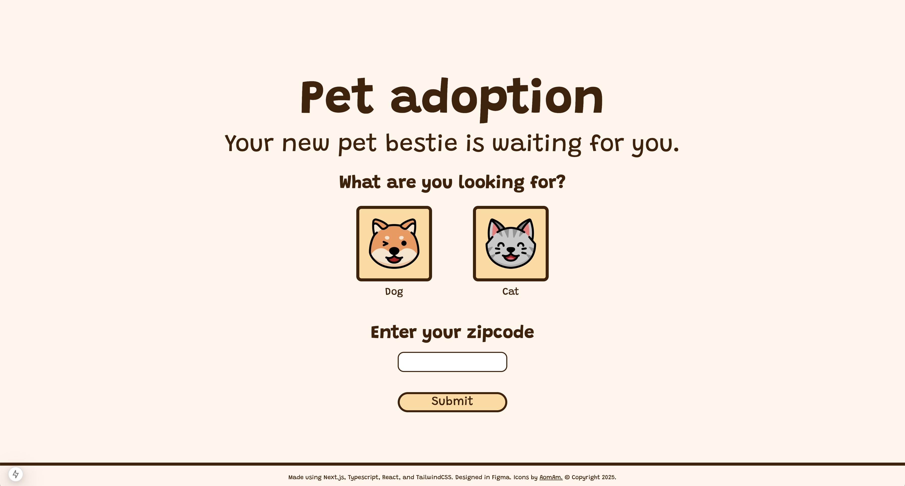

# [Pet adoption app](https://pet-adoption-three-eta.vercel.app/)
This application allows users to look for a dog or cat to adopt.

# Technologies used
- Next.js, TypeScript, React, Tailwind CSS, Leaflet/React Leaflet, PetFinder API.

# Description
This is a full-stack application that allows users to find either a dog or a cat to adopt, integrating the PetFinder API.  On the frontend, a user selects either a dog or a cat, enters a zipcode, and clicks on the "Submit" button.  A request is made to the PetFinder API on the backend, and retrieved data is rendered on the frontend.  Additionally, the shelter location is displayed on an interactive map using Leaflet and React Leaflet.  Tailwind was used to style the application.  The application can be found [here](https://pet-adoption-three-eta.vercel.app/).

# Images

